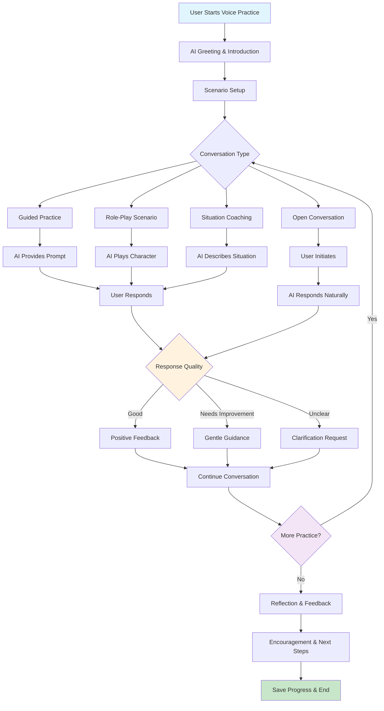

# Social Cue Voice Chatbot Design Document

## Overview

The Social Cue Voice Chatbot enables users to practice social skills through natural spoken conversations with an AI coach. The AI serves as a supportive, patient, and encouraging practice partner that adapts to the user's age and skill level.

## 1. Entry Points

### Primary Entry Points
- **Voice Practice Button**: New prominent button on Practice screen
- **Mode Toggle**: Switch between text-based and voice practice in existing sessions
- **Voice Practice Tab**: Dedicated navigation tab for voice-only practice
- **Quick Start**: "Try Voice Practice" option in onboarding

### Secondary Entry Points
- **Session Results**: "Practice this scenario with voice" suggestion
- **Goals Screen**: Voice practice goals and achievements
- **Parent Dashboard**: Voice practice progress for parents

## 2. Conversation Structure

### Phase 1: Greeting & Introduction (30-60 seconds)
```
AI: "Hi! I'm your social skills coach. I'm here to help you practice talking with others. 
    What's your name?"
User: [Responds]
AI: "Nice to meet you, [Name]! Today we're going to practice [scenario]. 
    Are you ready to start?"
```

### Phase 2: Scenario Setup (30-45 seconds)
```
AI: "Here's the situation: You're at lunch and you see someone sitting alone. 
    You'd like to make a new friend. What would you say to start a conversation?"
```

### Phase 3: Interactive Practice (2-5 minutes)
- **Guided Practice**: AI provides prompts and responds naturally
- **Role-play**: AI plays the other person in the scenario
- **Coaching**: AI guides user through the conversation
- **Open Practice**: User leads the conversation

### Phase 4: Feedback & Reflection (60-90 seconds)
```
AI: "Great job! You did really well with [specific positive feedback]. 
    One thing to remember is [gentle suggestion]. 
    How did that conversation feel to you?"
```

### Phase 5: Completion & Encouragement (30 seconds)
```
AI: "You're getting better at this! Keep practicing and you'll feel more confident. 
    Would you like to try another scenario?"
```

## 3. AI Personality Guidelines

### Core Personality Traits
- **Warm & Encouraging**: Always positive, celebrates effort
- **Patient**: Comfortable with pauses, "um"s, and thinking time
- **Age-Appropriate**: Language complexity matches grade level
- **Supportive**: Focuses on growth, not perfection
- **Natural**: Uses conversational fillers and natural speech patterns

### Grade Level Adaptations

#### Elementary (K-5)
- Simple vocabulary and sentence structure
- More encouragement and praise
- Shorter conversation segments
- Visual cues and prompts
- "Great job!" and "You're doing awesome!"

#### Middle School (6-8)
- Age-appropriate slang and references
- Balanced encouragement and gentle correction
- Longer conversation practice
- Peer relationship scenarios
- "That was really good!" and "Nice try!"

#### High School (9-12)
- More sophisticated language
- Career and adult interaction scenarios
- Subtle feedback and suggestions
- Independence-focused encouragement
- "Well done" and "That shows real maturity"

### Speech Patterns
- **Natural Pacing**: Slight pauses, conversational rhythm
- **Emotional Tone**: Warm, friendly, slightly excited
- **Volume**: Calm and steady, not overwhelming
- **Accent**: Neutral American English
- **Gender**: Neutral or user-selectable

## 4. Conversation Types

### 4.1 Guided Practice
**Purpose**: Structured learning with AI prompts
**Flow**: AI asks questions → User responds → AI provides feedback → Next prompt
**Example**:
```
AI: "Let's practice introducing yourself. I'll be a new student in your class. 
    What would you say to me?"
User: "Hi, I'm Sarah."
AI: "That's a good start! I'm Alex. What else could you say to keep the conversation going?"
```

### 4.2 Role-Play Scenarios
**Purpose**: Practice real-world interactions
**Flow**: AI plays character → User interacts → AI responds in character → Debrief
**Example**:
```
AI: "I'm going to be your classmate who just moved here. I look a bit nervous. 
    What would you say to me?"
User: "Hi, are you new here?"
AI: [As nervous classmate] "Yeah, I just moved from California. I don't know anyone yet."
User: "I can show you around if you want."
AI: [Switches to coach] "That was really kind! You offered help and made me feel welcome."
```

### 4.3 Open-Ended Conversation
**Purpose**: Free-form practice
**Flow**: User initiates → AI responds naturally → Conversation flows → Gentle guidance
**Example**:
```
User: "I want to practice talking to someone I like."
AI: "That's a great thing to practice! What would you like to talk about with them?"
User: "I don't know what to say."
AI: "That's totally normal! What do you know about them? Their interests? 
    That's usually a good place to start."
```

### 4.4 Situation Coaching
**Purpose**: Navigate specific challenging situations
**Flow**: AI describes situation → User explains approach → AI guides through better approach
**Example**:
```
AI: "You're in a group project and one person isn't contributing. 
    How would you handle this?"
User: "I'd just do their work."
AI: "I understand wanting to get it done, but that might not help them learn. 
    What's a way you could encourage them to participate?"
```

## 5. Error Handling

### 5.1 User Doesn't Speak / Mic Issues
```
AI: "I didn't hear anything. Let me check - can you say 'hello' to test your microphone?"
[If still no response]
AI: "It looks like there might be a microphone issue. Would you like to switch to text practice instead?"
```

### 5.2 AI Doesn't Understand Response
```
AI: "I'm not sure I caught that. Could you try saying it again, maybe a bit slower?"
[If still unclear after 2 attempts]
AI: "I'm having trouble understanding. Let's try a different approach - 
    would you like to type your response instead?"
```

### 5.3 Awkward Silences
```
AI: "Take your time! There's no rush. Sometimes the best conversations happen when we think before we speak."
[After 10 seconds]
AI: "Would you like me to give you a hint, or would you prefer to keep thinking?"
```

### 5.4 User Gets Stuck
```
AI: "It's okay to feel stuck! This is practice, remember? 
    What's one small thing you could say to start?"
[If still stuck]
AI: "How about I give you a few options to choose from?"
```

### 5.5 Technical Failures
```
AI: "I'm experiencing some technical difficulties. Let me try to reconnect..."
[If fails]
AI: "I'm having trouble with the connection. Your progress has been saved. 
    Would you like to continue with text practice or try again later?"
```

## 6. Example Conversation: "Starting a Conversation with a New Friend" (6th Grade)

### Complete Conversation Flow

```
AI: "Hi there! I'm your social skills coach. I'm here to help you practice talking with others. What's your name?"

User: "I'm Jake."

AI: "Nice to meet you, Jake! I'm really excited to practice with you today. 
    We're going to work on starting conversations with new people. 
    Does that sound good to you?"

User: "Yeah, I guess so."

AI: "Great! Here's the situation: You're at lunch and you see someone new sitting alone. 
    They look like they might want someone to talk to. What would you say to start a conversation?"

User: "Um... I don't know."

AI: "That's totally okay! Starting conversations can feel tricky. 
    What's one thing you could say to be friendly?"

User: "Maybe... hi?"

AI: "That's a perfect start! 'Hi' is always a good beginning. 
    What could you say after 'hi' to keep the conversation going?"

User: "I could ask their name?"

AI: "Excellent idea! That shows you're interested in getting to know them. 
    Let's practice this together. I'll be the new person. 
    You start the conversation, and I'll respond naturally. Ready?"

User: "Okay."

AI: "I'm sitting alone at a table, looking around the cafeteria..."

User: "Hi, what's your name?"

AI: [As new student] "Oh, hi! I'm Emma. I'm new here. What's your name?"

User: "I'm Jake. Are you liking the school so far?"

AI: [As new student] "It's okay, I guess. It's pretty different from my old school. 
    I don't really know anyone yet."

User: "Well, you know me now! Do you want to sit with my friends?"

AI: [Switches to coach] "Wow, Jake! That was really thoughtful of you! 
    You introduced yourself, asked about her experience, and then invited her to join your group. 
    That's exactly how you make someone feel welcome. How did that conversation feel to you?"

User: "It felt pretty good, actually."

AI: "I'm so glad! You did really well. You were friendly, asked good questions, 
    and made Emma feel included. Those are all great social skills. 
    What do you think made the conversation go well?"

User: "I guess I just tried to be nice and ask about her."

AI: "Exactly! Being genuinely interested in others and showing kindness 
    are the keys to good conversations. You're already really good at this! 
    Would you like to try another scenario, or do you feel ready to practice with real people?"

User: "Maybe one more practice."

AI: "Perfect! Let's try a different situation..."
```

## 7. Integration with Existing Features

### 7.1 Connection to Current Practice Sessions
- **Hybrid Mode**: Toggle between text and voice practice within same session
- **Voice-Enhanced Feedback**: AI provides spoken feedback after text-based scenarios
- **Progressive Practice**: Start with text, advance to voice practice
- **Skill Transfer**: Voice practice reinforces text-based learning

### 7.2 Progress Tracking Integration
- **Points System**: Voice conversations earn points (same as text practice)
- **Mastery Levels**: Voice practice contributes to topic mastery
- **Session History**: Voice sessions appear in progress tracking
- **Achievements**: Special badges for voice practice milestones

### 7.3 Navigation Integration
- **Practice Screen**: Voice Practice button alongside existing options
- **Bottom Navigation**: Voice Practice tab (microphone icon)
- **Settings**: Voice preferences and microphone settings
- **Progress Screen**: Voice practice statistics and achievements

### 7.4 Parent Dashboard Integration
- **Voice Practice Progress**: Show voice conversation frequency and duration
- **Skill Development**: Track improvement in spoken communication
- **Encouragement Notes**: AI-generated insights about child's voice practice
- **Privacy Controls**: Parent settings for voice data collection

## 8. Technical Implementation Considerations

### 8.1 Voice Processing Pipeline
1. **Speech-to-Text**: Convert user speech to text
2. **Intent Recognition**: Understand user's communication intent
3. **Response Generation**: Generate appropriate AI response
4. **Text-to-Speech**: Convert AI response to natural speech
5. **Audio Playback**: Play AI response to user

### 8.2 Real-time Features
- **Live Transcription**: Show user's speech as text (optional)
- **Response Timing**: Natural pauses and conversation flow
- **Interruption Handling**: Graceful handling of user interruptions
- **Background Processing**: Maintain conversation context

### 8.3 Accessibility Features
- **Visual Cues**: Show when AI is listening vs. speaking
- **Text Alternatives**: Option to see AI responses as text
- **Volume Controls**: Adjustable AI voice volume
- **Speed Controls**: Adjustable AI speech rate

## 9. Conversation Flow Diagram



## 10. Success Metrics

### 10.1 User Engagement
- **Session Duration**: Average time spent in voice practice
- **Completion Rate**: Percentage of started conversations completed
- **Return Rate**: Users who return for multiple voice practice sessions
- **Satisfaction**: User feedback on voice practice experience

### 10.2 Learning Outcomes
- **Conversation Quality**: Improvement in user responses over time
- **Confidence Metrics**: Self-reported confidence in social situations
- **Skill Transfer**: Application of voice practice to real-world interactions
- **Progress Tracking**: Advancement through difficulty levels

### 10.3 Technical Performance
- **Speech Recognition Accuracy**: Percentage of correctly transcribed speech
- **Response Time**: Time from user speech to AI response
- **Error Rate**: Frequency of technical issues or misunderstandings
- **User Experience**: Smoothness of conversation flow

## 11. Future Enhancements

### 11.1 Advanced Features
- **Emotion Recognition**: Detect user's emotional state and respond appropriately
- **Personality Matching**: AI adapts personality to match user preferences
- **Group Practice**: Multiple users practice together with AI facilitation
- **Real-world Integration**: Practice with real people via AI coaching

### 11.2 Personalization
- **Learning Style Adaptation**: Adjust conversation style to user's learning preferences
- **Interest Integration**: Incorporate user's hobbies and interests into scenarios
- **Cultural Sensitivity**: Adapt scenarios to user's cultural background
- **Language Support**: Multi-language voice practice options

### 11.3 Analytics & Insights
- **Conversation Analysis**: Detailed analysis of conversation patterns
- **Progress Visualization**: Visual representation of skill development
- **Parent Insights**: Detailed reports for parents on child's progress
- **Teacher Integration**: Classroom integration and teacher dashboards

## Conclusion

The Social Cue Voice Chatbot represents a significant advancement in social skills education, providing users with a safe, supportive environment to practice real-world communication skills. By combining natural conversation flow with personalized AI coaching, this feature will help users build confidence and competence in social interactions.

The design prioritizes user experience, technical reliability, and educational effectiveness, ensuring that voice practice feels natural and engaging while providing meaningful learning outcomes.
